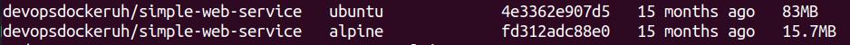

Output:
Alpine image is smaller than ubuntu's one

Commands to show secret message from ubuntu image:

`docker run -d --name secret-message devopsdockeruh/simple-web-service:ubuntu`
`docker exec -it secret-message /bin/bash -c "tail -f text.log"`

Commands to show secret message from alpine message:

`docker run -d --name secret-message-alpine devopsdockeruh/simple-web-service:alpine`
`docker exec -it secret-message /bin/sh -c "tail -f text.log"`
